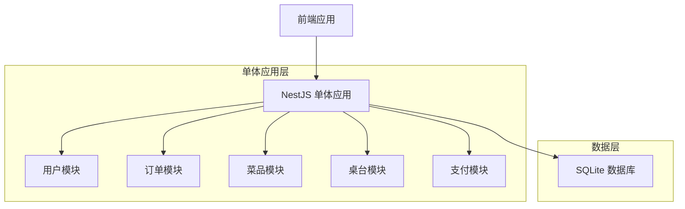
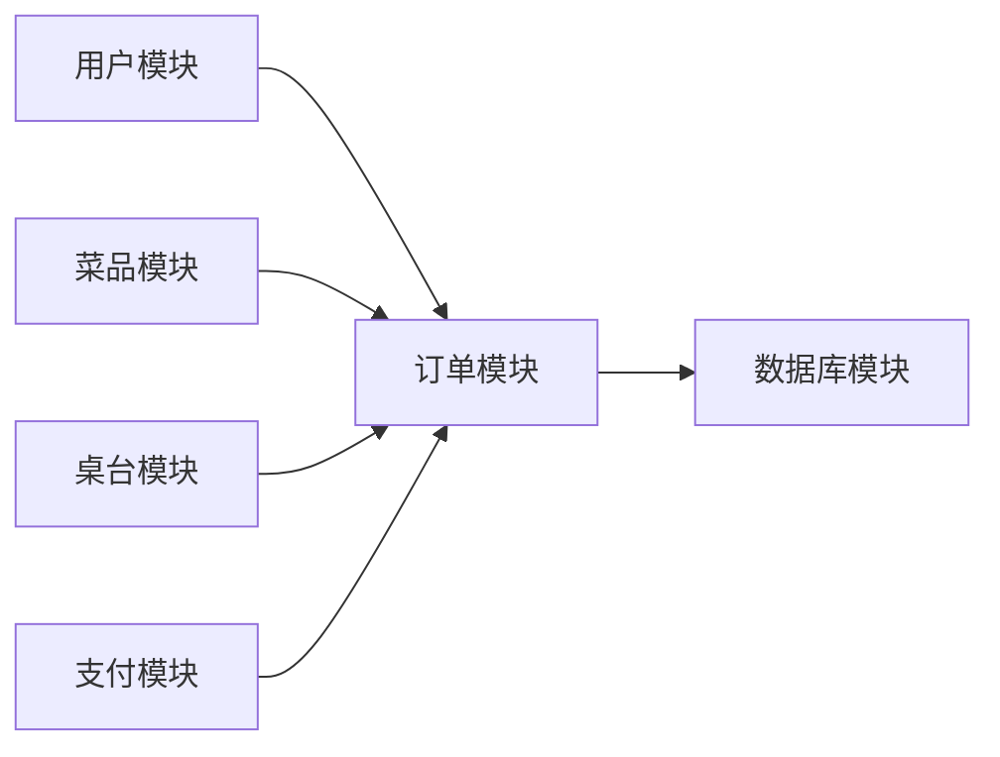
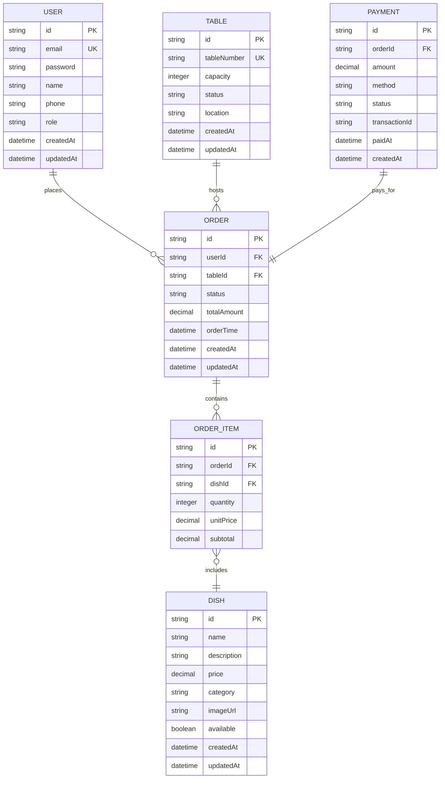

# 后端单体架构重构文档

## 1. 架构设计

### 1.1 整体架构
将原有的微服务架构（用户服务、订单服务、菜品服务、桌台服务、支付服务）重构为单体应用架构，所有模块集中在一个 NestJS 项目中。



### 1.2 模块依赖关系


## 2. 技术栈

- **后端框架**: NestJS@10
- **数据库 ORM**: Prisma@5
- **数据库**: SQLite
- **认证**: JWT (JSON Web Token)
- **API 文档**: Swagger/OpenAPI
- **测试框架**: Jest
- **代码规范**: ESLint + Prettier

## 3. 模块划分

### 3.1 模块结构
```
src/
├── modules/
│   ├── user/          # 用户模块
│   ├── order/         # 订单模块
│   ├── dish/          # 菜品模块
│   ├── table/         # 桌台模块
│   ├── payment/       # 支付模块
│   └── auth/          # 认证模块
├── common/
│   ├── guards/        # 守卫
│   ├── interceptors/  # 拦截器
│   ├── pipes/         # 管道
│   └── decorators/    # 装饰器
├── prisma/            # Prisma 配置
└── config/            # 配置文件
```

### 3.2 各模块职责

| 模块 | 职责 |
|------|------|
| 用户模块 | 用户注册、登录、个人信息管理、权限管理 |
| 订单模块 | 订单创建、状态更新、订单历史查询、订单统计 |
| 菜品模块 | 菜品信息管理、分类管理、库存管理、价格管理 |
| 桌台模块 | 桌台信息管理、状态管理、预约管理 |
| 支付模块 | 支付处理、支付状态查询、退款处理 |
| 认证模块 | JWT token 生成与验证、权限验证 |

## 4. API 规范

### 4.1 RESTful API 设计原则
- 使用 HTTP 动词表示操作（GET、POST、PUT、DELETE）
- 使用复数名词表示资源集合
- 使用 HTTP 状态码表示响应状态
- 统一的响应格式

### 4.2 统一响应格式
```typescript
interface ApiResponse<T> {
  code: number;
  message: string;
  data: T;
  timestamp: string;
}
```

### 4.3 主要 API 端点

#### 用户模块
| 端点 | 方法 | 描述 |
|------|------|------|
| /api/users | POST | 用户注册 |
| /api/users/login | POST | 用户登录 |
| /api/users/profile | GET | 获取用户信息 |
| /api/users/profile | PUT | 更新用户信息 |

#### 订单模块
| 端点 | 方法 | 描述 |
|------|------|------|
| /api/orders | POST | 创建订单 |
| /api/orders | GET | 获取订单列表 |
| /api/orders/:id | GET | 获取订单详情 |
| /api/orders/:id/status | PUT | 更新订单状态 |

#### 菜品模块
| 端点 | 方法 | 描述 |
|------|------|------|
| /api/dishes | GET | 获取菜品列表 |
| /api/dishes/:id | GET | 获取菜品详情 |
| /api/dishes | POST | 创建菜品 |
| /api/dishes/:id | PUT | 更新菜品信息 |

#### 桌台模块
| 端点 | 方法 | 描述 |
|------|------|------|
| /api/tables | GET | 获取桌台列表 |
| /api/tables/:id | GET | 获取桌台详情 |
| /api/tables/:id/status | PUT | 更新桌台状态 |

#### 支付模块
| 端点 | 方法 | 描述 |
|------|------|------|
| /api/payments | POST | 创建支付 |
| /api/payments/:id | GET | 获取支付状态 |
| /api/payments/:id/refund | POST | 退款处理 |

## 5. 数据库设计

### 5.1 数据模型关系图


### 5.2 数据库表结构

#### 用户表 (users)
```sql
CREATE TABLE users (
    id TEXT PRIMARY KEY DEFAULT (lower(hex(randomblob(16)))),
    email TEXT UNIQUE NOT NULL,
    password TEXT NOT NULL,
    name TEXT NOT NULL,
    phone TEXT,
    role TEXT DEFAULT 'customer' CHECK (role IN ('customer', 'admin', 'staff')),
    created_at DATETIME DEFAULT CURRENT_TIMESTAMP,
    updated_at DATETIME DEFAULT CURRENT_TIMESTAMP
);
```

#### 订单表 (orders)
```sql
CREATE TABLE orders (
    id TEXT PRIMARY KEY DEFAULT (lower(hex(randomblob(16)))),
    user_id TEXT NOT NULL,
    table_id TEXT,
    status TEXT DEFAULT 'pending' CHECK (status IN ('pending', 'confirmed', 'preparing', 'served', 'completed', 'cancelled')),
    total_amount DECIMAL(10,2) DEFAULT 0,
    order_time DATETIME DEFAULT CURRENT_TIMESTAMP,
    created_at DATETIME DEFAULT CURRENT_TIMESTAMP,
    updated_at DATETIME DEFAULT CURRENT_TIMESTAMP,
    FOREIGN KEY (user_id) REFERENCES users(id),
    FOREIGN KEY (table_id) REFERENCES tables(id)
);
```

#### 订单项表 (order_items)
```sql
CREATE TABLE order_items (
    id TEXT PRIMARY KEY DEFAULT (lower(hex(randomblob(16)))),
    order_id TEXT NOT NULL,
    dish_id TEXT NOT NULL,
    quantity INTEGER NOT NULL DEFAULT 1,
    unit_price DECIMAL(10,2) NOT NULL,
    subtotal DECIMAL(10,2) NOT NULL,
    FOREIGN KEY (order_id) REFERENCES orders(id) ON DELETE CASCADE,
    FOREIGN KEY (dish_id) REFERENCES dishes(id)
);
```

#### 菜品表 (dishes)
```sql
CREATE TABLE dishes (
    id TEXT PRIMARY KEY DEFAULT (lower(hex(randomblob(16)))),
    name TEXT NOT NULL,
    description TEXT,
    price DECIMAL(10,2) NOT NULL,
    category TEXT NOT NULL,
    image_url TEXT,
    available BOOLEAN DEFAULT true,
    created_at DATETIME DEFAULT CURRENT_TIMESTAMP,
    updated_at DATETIME DEFAULT CURRENT_TIMESTAMP
);
```

#### 桌台表 (tables)
```sql
CREATE TABLE tables (
    id TEXT PRIMARY KEY DEFAULT (lower(hex(randomblob(16)))),
    table_number TEXT UNIQUE NOT NULL,
    capacity INTEGER NOT NULL,
    status TEXT DEFAULT 'available' CHECK (status IN ('available', 'occupied', 'reserved', 'cleaning')),
    location TEXT,
    created_at DATETIME DEFAULT CURRENT_TIMESTAMP,
    updated_at DATETIME DEFAULT CURRENT_TIMESTAMP
);
```

#### 支付表 (payments)
```sql
CREATE TABLE payments (
    id TEXT PRIMARY KEY DEFAULT (lower(hex(randomblob(16)))),
    order_id TEXT UNIQUE NOT NULL,
    amount DECIMAL(10,2) NOT NULL,
    method TEXT NOT NULL CHECK (method IN ('cash', 'card', 'wechat', 'alipay')),
    status TEXT DEFAULT 'pending' CHECK (status IN ('pending', 'completed', 'failed', 'refunded')),
    transaction_id TEXT,
    paid_at DATETIME,
    created_at DATETIME DEFAULT CURRENT_TIMESTAMP,
    FOREIGN KEY (order_id) REFERENCES orders(id)
);
```

### 5.3 索引设计
```sql
-- 用户表索引
CREATE INDEX idx_users_email ON users(email);
CREATE INDEX idx_users_role ON users(role);

-- 订单表索引
CREATE INDEX idx_orders_user_id ON orders(user_id);
CREATE INDEX idx_orders_status ON orders(status);
CREATE INDEX idx_orders_created_at ON orders(created_at DESC);

-- 订单项表索引
CREATE INDEX idx_order_items_order_id ON order_items(order_id);
CREATE INDEX idx_order_items_dish_id ON order_items(dish_id);

-- 菜品表索引
CREATE INDEX idx_dishes_category ON dishes(category);
CREATE INDEX idx_dishes_available ON dishes(available);

-- 桌台表索引
CREATE INDEX idx_tables_status ON tables(status);
CREATE INDEX idx_tables_capacity ON tables(capacity);

-- 支付表索引
CREATE INDEX idx_payments_order_id ON payments(order_id);
CREATE INDEX idx_payments_status ON payments(status);
CREATE INDEX idx_payments_created_at ON payments(created_at DESC);
```

## 6. 配置示例

### 6.1 Prisma Schema (schema.prisma)
```prisma
// This is your Prisma schema file,
// learn more about it in the docs: https://pris.ly/d/prisma-schema

generator client {
  provider = "prisma-client-js"
}

datasource db {
  provider = "sqlite"
  url      = env("DATABASE_URL")
}

model User {
  id        String   @id @default(cuid())
  email     String   @unique
  password  String
  name      String
  phone     String?
  role      Role     @default(CUSTOMER)
  createdAt DateTime @default(now())
  updatedAt DateTime @updatedAt
  
  orders    Order[]
  
  @@map("users")
}

model Order {
  id         String      @id @default(cuid())
  userId     String
  tableId    String?
  status     OrderStatus @default(PENDING)
  totalAmount Decimal     @default(0)
  orderTime  DateTime    @default(now())
  createdAt  DateTime    @default(now())
  updatedAt  DateTime    @updatedAt
  
  user       User        @relation(fields: [userId], references: [id])
  table      Table?      @relation(fields: [tableId], references: [id])
  items      OrderItem[]
  payment    Payment?
  
  @@map("orders")
}

model OrderItem {
  id         String  @id @default(cuid())
  orderId    String
  dishId     String
  quantity   Int     @default(1)
  unitPrice  Decimal
  subtotal   Decimal
  
  order      Order   @relation(fields: [orderId], references: [id], onDelete: Cascade)
  dish       Dish    @relation(fields: [dishId], references: [id])
  
  @@map("order_items")
}

model Dish {
  id          String   @id @default(cuid())
  name        String
  description String?
  price       Decimal
  category    String
  imageUrl    String?
  available   Boolean  @default(true)
  createdAt   DateTime @default(now())
  updatedAt   DateTime @updatedAt
  
  orderItems  OrderItem[]
  
  @@map("dishes")
}

model Table {
  id           String      @id @default(cuid())
  tableNumber  String      @unique
  capacity     Int
  status       TableStatus @default(AVAILABLE)
  location     String?
  createdAt    DateTime    @default(now())
  updatedAt    DateTime    @updatedAt
  
  orders       Order[]
  
  @@map("tables")
}

model Payment {
  id            String        @id @default(cuid())
  orderId       String        @unique
  amount        Decimal
  method        PaymentMethod
  status        PaymentStatus @default(PENDING)
  transactionId String?
  paidAt        DateTime?
  createdAt     DateTime      @default(now())
  
  order         Order         @relation(fields: [orderId], references: [id])
  
  @@map("payments")
}

enum Role {
  CUSTOMER
  STAFF
  ADMIN
}

enum OrderStatus {
  PENDING
  CONFIRMED
  PREPARING
  SERVED
  COMPLETED
  CANCELLED
}

enum TableStatus {
  AVAILABLE
  OCCUPIED
  RESERVED
  CLEANING
}

enum PaymentMethod {
  CASH
  CARD
  WECHAT
  ALIPAY
}

enum PaymentStatus {
  PENDING
  COMPLETED
  FAILED
  REFUNDED
}
```

## 7. 部署配置

### 7.1 环境变量 (.env)
```bash
# 数据库配置
DATABASE_URL="file:./dev.db"

# JWT 配置
JWT_SECRET="your-jwt-secret-key"
JWT_EXPIRES_IN="7d"

# 服务器配置
PORT=3000
NODE_ENV=development

# Swagger 配置
SWAGGER_TITLE="Food Ordering API"
SWAGGER_DESCRIPTION="Restaurant ordering system API"
SWAGGER_VERSION="1.0.0"
```

### 7.2 启动脚本 (package.json)
```json
{
  "scripts": {
    "build": "nest build",
    "format": "prettier --write \"src/**/*.ts\" \"test/**/*.ts\"",
    "start": "nest start",
    "start:dev": "nest start --watch",
    "start:debug": "nest start --debug --watch",
    "start:prod": "node dist/main",
    "lint": "eslint \"{src,apps,libs,test}/**/*.ts\" --fix",
    "test": "jest",
    "test:watch": "jest --watch",
    "test:cov": "jest --coverage",
    "test:debug": "node --inspect-brk -r tsconfig-paths/register -r ts-node/register node_modules/.bin/jest --runInBand",
    "test:e2e": "jest --config ./test/jest-e2e.json",
    "prisma:generate": "prisma generate",
    "prisma:migrate": "prisma migrate dev",
    "prisma:studio": "prisma studio",
    "prisma:seed": "ts-node prisma/seed.ts"
  }
}
```

## 8. 性能优化建议

### 8.1 数据库优化
- 使用适当的索引策略
- 实施数据库连接池
- 定期分析和优化查询
- 考虑实施缓存策略

### 8.2 应用层优化
- 实施响应缓存
- 使用异步处理
- 实施请求限流
- 优化错误处理

### 8.3 监控和日志
- 实施应用性能监控
- 设置错误追踪
- 记录关键业务指标
- 实施健康检查端点