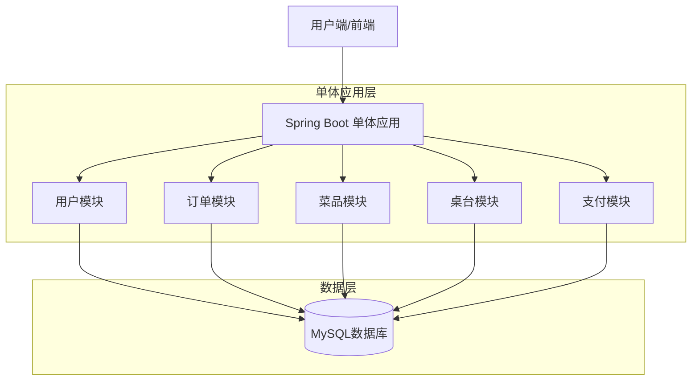
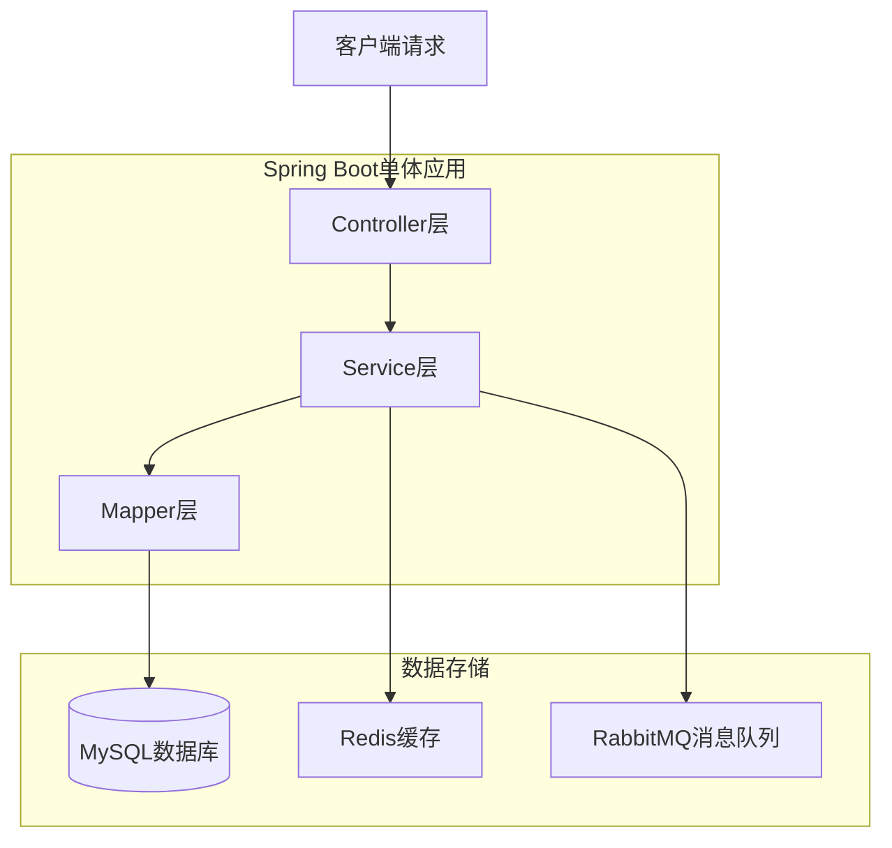
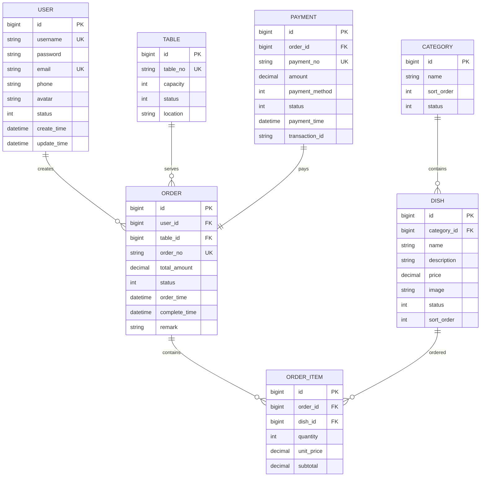

# 后端Java单体架构设计文档

## 1. 架构设计



## 2. 技术描述

- 后端框架: Spring Boot 2.7.x + MyBatis-Plus 3.5.x
- 数据库: MySQL 8.0
- 连接池: HikariCP
- 缓存: Redis (可选)
- 消息队列: RabbitMQ (可选)
- 构建工具: Maven 3.8+
- JDK版本: 11+

## 3. 模块划分

### 3.1 模块结构
```
src/main/java/com/foodordering/
├── controller/          # 控制器层
│   ├── user/           # 用户相关接口
│   ├── order/          # 订单相关接口
│   ├── dish/           # 菜品相关接口
│   ├── table/          # 桌台相关接口
│   └── payment/        # 支付相关接口
├── service/            # 服务层
│   ├── user/           # 用户服务
│   ├── order/          # 订单服务
│   ├── dish/           # 菜品服务
│   ├── table/          # 桌台服务
│   └── payment/        # 支付服务
├── mapper/             # 数据访问层
│   ├── user/           # 用户数据访问
│   ├── order/          # 订单数据访问
│   ├── dish/           # 菜品数据访问
│   ├── table/          # 桌台数据访问
│   └── payment/        # 支付数据访问
├── entity/             # 实体类
├── dto/                # 数据传输对象
├── vo/                 # 视图对象
└── config/             # 配置类
```

## 4. API定义

### 4.1 用户模块API

#### 用户注册
```
POST /api/user/register
```

请求参数:
| 参数名 | 参数类型 | 是否必需 | 描述 |
|--------|----------|----------|------|
| username | string | 是 | 用户名 |
| password | string | 是 | 密码 |
| email | string | 是 | 邮箱 |
| phone | string | 否 | 手机号 |

响应示例:
```json
{
  "code": 200,
  "message": "注册成功",
  "data": {
    "userId": 1234567890,
    "username": "zhangsan"
  }
}
```

#### 用户登录
```
POST /api/user/login
```

请求参数:
| 参数名 | 参数类型 | 是否必需 | 描述 |
|--------|----------|----------|------|
| username | string | 是 | 用户名或邮箱 |
| password | string | 是 | 密码 |

### 4.2 菜品模块API

#### 获取菜品列表
```
GET /api/dish/list
```

请求参数:
| 参数名 | 参数类型 | 是否必需 | 描述 |
|--------|----------|----------|------|
| categoryId | long | 否 | 分类ID |
| page | int | 否 | 页码，默认1 |
| size | int | 否 | 每页数量，默认10 |

#### 获取菜品详情
```
GET /api/dish/{id}
```

### 4.3 订单模块API

#### 创建订单
```
POST /api/order/create
```

请求参数:
| 参数名 | 参数类型 | 是否必需 | 描述 |
|--------|----------|----------|------|
| tableId | long | 是 | 桌台ID |
| dishItems | array | 是 | 菜品项列表 |
| remark | string | 否 | 备注 |

#### 获取订单详情
```
GET /api/order/{orderId}
```

### 4.4 桌台模块API

#### 获取桌台状态
```
GET /api/table/status
```

#### 预订桌台
```
POST /api/table/reserve
```

### 4.5 支付模块API

#### 创建支付订单
```
POST /api/payment/create
```

#### 查询支付状态
```
GET /api/payment/status/{orderId}
```

## 5. 服务器架构图



## 6. 数据模型

### 6.1 数据模型定义



### 6.2 数据定义语言

#### 用户表 (users)
```sql
CREATE TABLE users (
    id BIGINT PRIMARY KEY AUTO_INCREMENT,
    username VARCHAR(50) UNIQUE NOT NULL COMMENT '用户名',
    password VARCHAR(255) NOT NULL COMMENT '密码',
    email VARCHAR(100) UNIQUE NOT NULL COMMENT '邮箱',
    phone VARCHAR(20) COMMENT '手机号',
    avatar VARCHAR(255) COMMENT '头像URL',
    status TINYINT DEFAULT 1 COMMENT '状态：1正常，0禁用',
    create_time DATETIME DEFAULT CURRENT_TIMESTAMP,
    update_time DATETIME DEFAULT CURRENT_TIMESTAMP ON UPDATE CURRENT_TIMESTAMP,
    INDEX idx_username (username),
    INDEX idx_email (email)
) ENGINE=InnoDB DEFAULT CHARSET=utf8mb4 COMMENT='用户表';
```

#### 菜品分类表 (categories)
```sql
CREATE TABLE categories (
    id BIGINT PRIMARY KEY AUTO_INCREMENT,
    name VARCHAR(50) NOT NULL COMMENT '分类名称',
    sort_order INT DEFAULT 0 COMMENT '排序',
    status TINYINT DEFAULT 1 COMMENT '状态：1启用，0禁用',
    create_time DATETIME DEFAULT CURRENT_TIMESTAMP,
    update_time DATETIME DEFAULT CURRENT_TIMESTAMP ON UPDATE CURRENT_TIMESTAMP,
    INDEX idx_status (status)
) ENGINE=InnoDB DEFAULT CHARSET=utf8mb4 COMMENT='菜品分类表';
```

#### 菜品表 (dishes)
```sql
CREATE TABLE dishes (
    id BIGINT PRIMARY KEY AUTO_INCREMENT,
    category_id BIGINT NOT NULL COMMENT '分类ID',
    name VARCHAR(100) NOT NULL COMMENT '菜品名称',
    description TEXT COMMENT '菜品描述',
    price DECIMAL(10,2) NOT NULL COMMENT '价格',
    image VARCHAR(255) COMMENT '图片URL',
    status TINYINT DEFAULT 1 COMMENT '状态：1上架，0下架',
    sort_order INT DEFAULT 0 COMMENT '排序',
    create_time DATETIME DEFAULT CURRENT_TIMESTAMP,
    update_time DATETIME DEFAULT CURRENT_TIMESTAMP ON UPDATE CURRENT_TIMESTAMP,
    INDEX idx_category (category_id),
    INDEX idx_status (status),
    FOREIGN KEY (category_id) REFERENCES categories(id)
) ENGINE=InnoDB DEFAULT CHARSET=utf8mb4 COMMENT='菜品表';
```

#### 桌台表 (tables)
```sql
CREATE TABLE tables (
    id BIGINT PRIMARY KEY AUTO_INCREMENT,
    table_no VARCHAR(20) UNIQUE NOT NULL COMMENT '桌台编号',
    capacity INT NOT NULL COMMENT '容纳人数',
    status TINYINT DEFAULT 0 COMMENT '状态：0空闲，1占用，2预订',
    location VARCHAR(100) COMMENT '位置描述',
    create_time DATETIME DEFAULT CURRENT_TIMESTAMP,
    update_time DATETIME DEFAULT CURRENT_TIMESTAMP ON UPDATE CURRENT_TIMESTAMP,
    INDEX idx_status (status)
) ENGINE=InnoDB DEFAULT CHARSET=utf8mb4 COMMENT='桌台表';
```

#### 订单表 (orders)
```sql
CREATE TABLE orders (
    id BIGINT PRIMARY KEY AUTO_INCREMENT,
    user_id BIGINT NOT NULL COMMENT '用户ID',
    table_id BIGINT COMMENT '桌台ID',
    order_no VARCHAR(32) UNIQUE NOT NULL COMMENT '订单编号',
    total_amount DECIMAL(10,2) NOT NULL COMMENT '订单总金额',
    status TINYINT DEFAULT 0 COMMENT '状态：0待支付，1已支付，2制作中，3已完成，4已取消',
    order_time DATETIME DEFAULT CURRENT_TIMESTAMP COMMENT '下单时间',
    complete_time DATETIME COMMENT '完成时间',
    remark TEXT COMMENT '备注',
    create_time DATETIME DEFAULT CURRENT_TIMESTAMP,
    update_time DATETIME DEFAULT CURRENT_TIMESTAMP ON UPDATE CURRENT_TIMESTAMP,
    INDEX idx_user_id (user_id),
    INDEX idx_table_id (table_id),
    INDEX idx_order_no (order_no),
    INDEX idx_status (status),
    FOREIGN KEY (user_id) REFERENCES users(id),
    FOREIGN KEY (table_id) REFERENCES tables(id)
) ENGINE=InnoDB DEFAULT CHARSET=utf8mb4 COMMENT='订单表';
```

#### 订单明细表 (order_items)
```sql
CREATE TABLE order_items (
    id BIGINT PRIMARY KEY AUTO_INCREMENT,
    order_id BIGINT NOT NULL COMMENT '订单ID',
    dish_id BIGINT NOT NULL COMMENT '菜品ID',
    quantity INT NOT NULL COMMENT '数量',
    unit_price DECIMAL(10,2) NOT NULL COMMENT '单价',
    subtotal DECIMAL(10,2) NOT NULL COMMENT '小计',
    create_time DATETIME DEFAULT CURRENT_TIMESTAMP,
    INDEX idx_order_id (order_id),
    INDEX idx_dish_id (dish_id),
    FOREIGN KEY (order_id) REFERENCES orders(id),
    FOREIGN KEY (dish_id) REFERENCES dishes(id)
) ENGINE=InnoDB DEFAULT CHARSET=utf8mb4 COMMENT='订单明细表';
```

#### 支付表 (payments)
```sql
CREATE TABLE payments (
    id BIGINT PRIMARY KEY AUTO_INCREMENT,
    order_id BIGINT NOT NULL COMMENT '订单ID',
    payment_no VARCHAR(32) UNIQUE NOT NULL COMMENT '支付编号',
    amount DECIMAL(10,2) NOT NULL COMMENT '支付金额',
    payment_method TINYINT NOT NULL COMMENT '支付方式：1支付宝，2微信，3现金',
    status TINYINT DEFAULT 0 COMMENT '状态：0待支付，1支付成功，2支付失败',
    payment_time DATETIME COMMENT '支付时间',
    transaction_id VARCHAR(64) COMMENT '第三方交易号',
    create_time DATETIME DEFAULT CURRENT_TIMESTAMP,
    update_time DATETIME DEFAULT CURRENT_TIMESTAMP ON UPDATE CURRENT_TIMESTAMP,
    INDEX idx_order_id (order_id),
    INDEX idx_payment_no (payment_no),
    INDEX idx_status (status),
    FOREIGN KEY (order_id) REFERENCES orders(id)
) ENGINE=InnoDB DEFAULT CHARSET=utf8mb4 COMMENT='支付表';
```

### 6.3 初始化数据

```sql
-- 初始化菜品分类数据
INSERT INTO categories (name, sort_order) VALUES
('热菜', 1),
('凉菜', 2),
('汤品', 3),
('主食', 4),
('饮品', 5),
('甜品', 6);

-- 初始化桌台数据
INSERT INTO tables (table_no, capacity, location) VALUES
('A01', 2, '大厅1号桌'),
('A02', 4, '大厅2号桌'),
('A03', 6, '大厅3号桌'),
('B01', 8, '包间1号'),
('B02', 10, '包间2号');

-- 初始化菜品数据
INSERT INTO dishes (category_id, name, description, price, image, sort_order) VALUES
(1, '宫保鸡丁', '经典川菜，鸡肉嫩滑，花生香脆', 38.00, '/images/gongbao_jiding.jpg', 1),
(1, '麻婆豆腐', '四川传统名菜，麻辣鲜香', 28.00, '/images/mapo_doufu.jpg', 2),
(2, '凉拌黄瓜', '清爽开胃，夏日必备', 18.00, '/images/liangban_huanggu.jpg', 1),
(3, '西红柿鸡蛋汤', '家常汤品，营养丰富', 22.00, '/images/xihongshi_jidan_tang.jpg', 1),
(4, '蛋炒饭', '粒粒分明，香气扑鼻', 15.00, '/images/dan_chaofan.jpg', 1),
(5, '可乐', '可口可乐，冰镇更佳', 8.00, '/images/kele.jpg', 1);
```

## 7. 配置说明

### 7.1 application.yml配置
```yaml
server:
  port: 8080
  servlet:
    context-path: /api

spring:
  datasource:
    driver-class-name: com.mysql.cj.jdbc.Driver
    url: jdbc:mysql://localhost:3306/food_ordering?useUnicode=true&characterEncoding=utf-8&serverTimezone=Asia/Shanghai
    username: root
    password: password
    hikari:
      maximum-pool-size: 20
      minimum-idle: 5
      connection-timeout: 30000
      idle-timeout: 600000
      max-lifetime: 1800000

  redis:
    host: localhost
    port: 6379
    password: 
    database: 0
    timeout: 5000ms
    lettuce:
      pool:
        max-active: 8
        max-idle: 8
        min-idle: 0

  rabbitmq:
    host: localhost
    port: 5672
    username: guest
    password: guest
    virtual-host: /

mybatis-plus:
  configuration:
    map-underscore-to-camel-case: true
    log-impl: org.apache.ibatis.logging.stdout.StdOutImpl
  global-config:
    db-config:
      id-type: ASSIGN_ID
      logic-delete-field: deleted
      logic-delete-value: 1
      logic-not-delete-value: 0
  mapper-locations: classpath*:mapper/**/*.xml

logging:
  level:
    com.foodordering: debug
```

### 7.2 Maven依赖配置
```xml
<dependencies>
    <!-- Spring Boot Starter -->
    <dependency>
        <groupId>org.springframework.boot</groupId>
        <artifactId>spring-boot-starter-web</artifactId>
    </dependency>
    
    <!-- MyBatis Plus -->
    <dependency>
        <groupId>com.baomidou</groupId>
        <artifactId>mybatis-plus-boot-starter</artifactId>
        <version>3.5.3.1</version>
    </dependency>
    
    <!-- MySQL -->
    <dependency>
        <groupId>mysql</groupId>
        <artifactId>mysql-connector-java</artifactId>
        <scope>runtime</scope>
    </dependency>
    
    <!-- Redis -->
    <dependency>
        <groupId>org.springframework.boot</groupId>
        <artifactId>spring-boot-starter-data-redis</artifactId>
    </dependency>
    
    <!-- RabbitMQ -->
    <dependency>
        <groupId>org.springframework.boot</groupId>
        <artifactId>spring-boot-starter-amqp</artifactId>
    </dependency>
    
    <!-- 其他常用依赖 -->
    <dependency>
        <groupId>org.springframework.boot</groupId>
        <artifactId>spring-boot-starter-validation</artifactId>
    </dependency>
    
    <dependency>
        <groupId>com.alibaba</groupId>
        <artifactId>fastjson2</artifactId>
        <version>2.0.40</version>
    </dependency>
    
    <dependency>
        <groupId>cn.hutool</groupId>
        <artifactId>hutool-all</artifactId>
        <version>5.8.22</version>
    </dependency>
</dependencies>
```