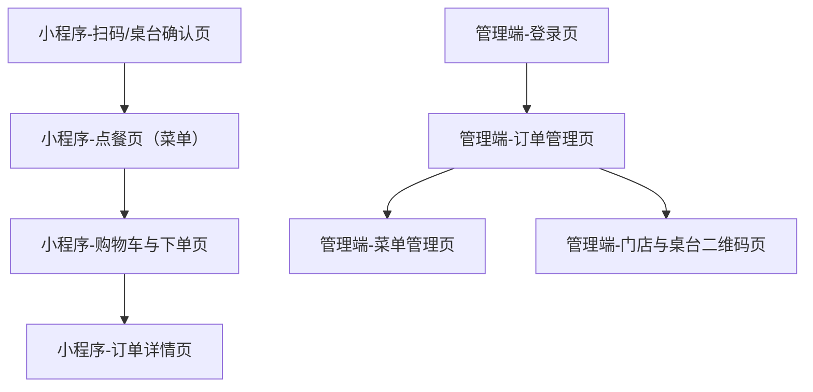

## 1. Product Overview
扫码线上点餐系统包含「微信小程序顾客端」与「Web管理端」，用于扫码选桌、浏览菜单、下单支付，以及商家侧订单与菜单运营管理。
核心价值：减少人工点单成本、提升出餐效率、沉淀经营数据。

## 2. Core Features

### 2.1 User Roles
| 角色 | 注册/登录方式 | 核心权限 |
|------|--------------|----------|
| 顾客（小程序） | 微信授权登录（静默获取openid/unionid） | 扫码绑定桌台、浏览菜品、下单支付、查看订单 |
| 商家管理员（管理端） | 账号密码登录 | 管理门店/桌台二维码、菜品与分类、订单处理、账号权限 |

### 2.2 Feature Module
系统需求由以下核心页面组成：
1. **小程序-扫码/桌台确认页**：识别桌台码、确认门店与桌号、异常提示。
2. **小程序-点餐页（菜单）**：分类切换、菜品列表、规格/数量选择、加入购物车。
3. **小程序-购物车与下单页**：购物车编辑、备注、优惠占位、提交订单、拉起支付。
4. **小程序-订单详情页**：订单状态流转、明细、支付结果、催单/加菜入口占位。
5. **管理端-登录页**：账号登录、退出、权限拦截。
6. **管理端-订单管理页**：订单列表/详情、接单/拒单/出餐/完成、打印占位。
7. **管理端-菜单管理页**：分类与菜品CRUD、上下架、规格与加料管理。
8. **管理端-门店与桌台二维码页**：门店信息、桌台管理、二维码生成与下载。

### 2.3 Page Details
| Page Name | Module Name | Feature description |
|-----------|-------------|---------------------|
| 小程序-扫码/桌台确认页 | 扫码解析 | 解析二维码参数（门店ID/桌台ID/签名占位），校验有效性并提示错误原因 |
| 小程序-扫码/桌台确认页 | 桌台绑定 | 确认门店名/桌号；绑定到本次点餐会话（本地缓存+服务端会话占位） |
| 小程序-点餐页（菜单） | 分类与列表 | 展示分类、菜品卡片（图/名/价/售罄/标签），支持搜索占位 |
| 小程序-点餐页（菜单） | 规格选择 | 选择规格/加料/口味（占位），设置数量并加入购物车 |
| 小程序-购物车与下单页 | 购物车编辑 | 增减数量、删除、清空、合计金额、起送/服务费占位 |
| 小程序-购物车与下单页 | 提交订单 | 填写备注（忌口/辣度占位），提交创建订单，返回支付参数占位 |
| 小程序-订单详情页 | 状态与明细 | 展示订单号、状态（待支付/已支付/制作中/已完成/已取消）、商品明细与金额 |
| 小程序-订单详情页 | 支付结果 | 拉起微信支付（占位）、展示成功/失败与重试入口 |
| 管理端-登录页 | 登录表单 | 输入账号/密码登录，获取token并保存；未登录路由跳转 |
| 管理端-订单管理页 | 订单列表 | 按状态筛选、时间范围、关键字（桌号/订单号）查询与分页 |
| 管理端-订单管理页 | 订单处理 | 查看详情；执行接单/拒单/出餐/完成（调用占位接口） |
| 管理端-菜单管理页 | 分类管理 | 新增/编辑/排序/删除分类（删除需校验占位） |
| 管理端-菜单管理页 | 菜品管理 | 菜品CRUD、图片上传占位、规格/加料配置、上下架 |
| 管理端-门店与桌台二维码页 | 门店信息 | 编辑门店名称、营业时间、联系电话、支付配置占位 |
| 管理端-门店与桌台二维码页 | 桌台与二维码 | 桌台CRUD；生成带参数二维码并下载/打印占位 |

## 3. Core Process
**顾客（小程序）流程**：你到店后扫码进入→系统识别桌台并让你确认→你浏览分类与菜品并加入购物车→在购物车确认数量与备注→提交订单并完成微信支付→在订单详情查看状态与支付结果。

**商家管理员（管理端）流程**：你登录管理端→在订单管理查看新订单→接单并更新为制作中/已完成→在菜单管理维护菜品与上下架→在门店与桌台二维码页维护桌台并生成二维码。

