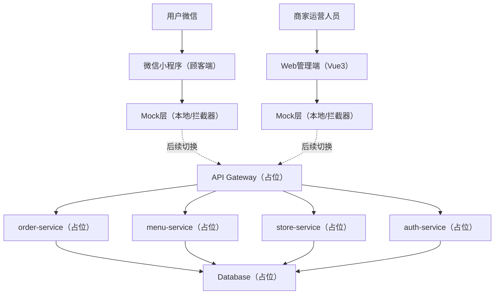
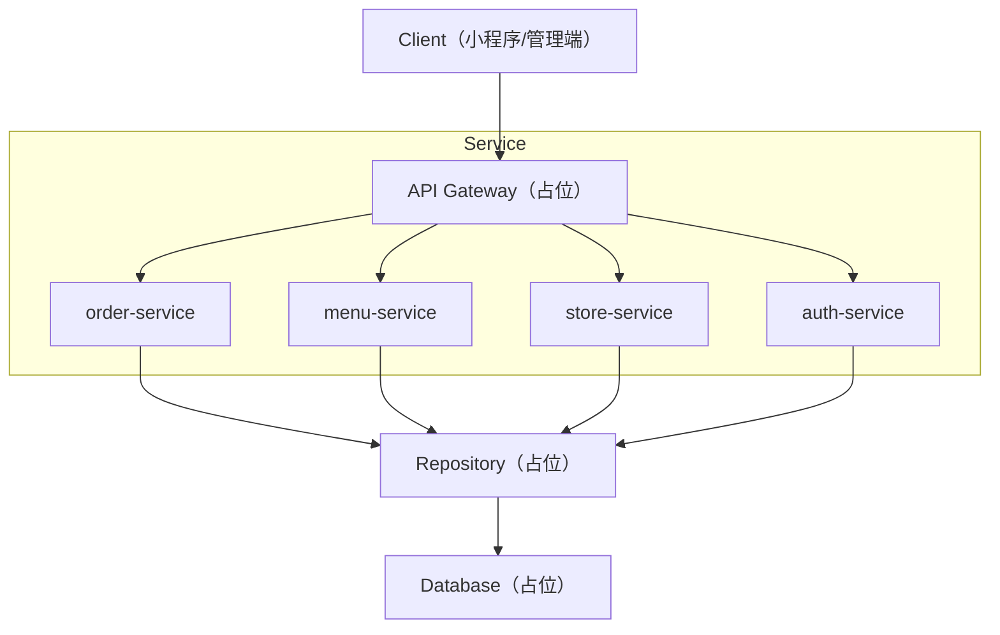
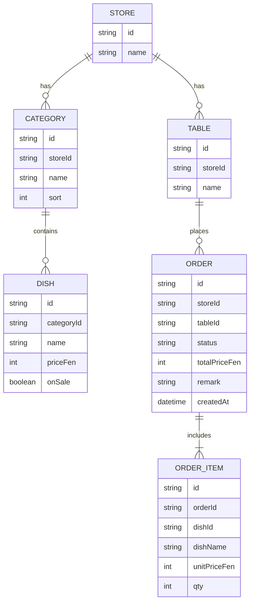

## 1.Architecture design
当前阶段：前端先用Mock跑通业务；后端以“微服务接口占位”定义契约，便于后续联调替换。



## 2.Technology Description
- 小程序端：微信小程序原生 + TypeScript（建议）+ API请求封装 + Mock数据
- 管理端：Vue@3 + TypeScript + Vite + vue-router + Pinia + Axios（或fetch封装）+ Mock
- Backend：微服务接口占位（后续可选 NestJS/Spring Cloud 等），当前不落地实现
- Database：占位（后续按规模选择 MySQL/PostgreSQL）

## 3.Route definitions
| App | Route | Purpose |
|-----|-------|---------|
| 小程序 | pages/scan/index | 扫码进入/桌台确认与绑定 |
| 小程序 | pages/menu/index | 菜单浏览、选规格、加购 |
| 小程序 | pages/cart/index | 购物车编辑、提交订单、支付拉起占位 |
| 小程序 | pages/orderDetail/index | 订单详情与状态、支付结果 |
| 管理端 | /login | 管理员登录 |
| 管理端 | /orders | 订单列表与处理 |
| 管理端 | /menu | 分类/菜品/规格管理 |
| 管理端 | /store-tables | 门店信息、桌台与二维码管理 |

## 4.API definitions (If it includes backend services)
### 4.1 Core Types (shared)
```ts
type ID = string;

type OrderStatus = 'PENDING_PAY'|'PAID'|'COOKING'|'DONE'|'CANCELED';

type Money = { currency: 'CNY'; amountFen: number };

type CartItem = {
  dishId: ID;
  dishName: string;
  skuId?: ID;
  skuName?: string;
  unitPrice: Money;
  qty: number;
};

type Order = {
  id: ID;
  storeId: ID;
  tableId: ID;
  tableName: string;
  status: OrderStatus;
  items: CartItem[];
  totalPrice: Money;
  remark?: string;
  createdAt: string;
};
```

### 4.2 API Contract (placeholder)
用户侧（小程序）
- `POST /api/v1/session/bind-table`：绑定门店/桌台（扫码参数）
- `GET /api/v1/menu?storeId=...`：获取菜单（分类+菜品+售罄）
- `POST /api/v1/orders`：创建订单（items/remark/table）
- `POST /api/v1/pay/wechat/prepay`：获取微信支付参数（占位）
- `GET /api/v1/orders/:id`：订单详情

管理端（Web）
- `POST /api/v1/admin/auth/login`：登录
- `GET /api/v1/admin/orders?status=&page=`：订单列表
- `POST /api/v1/admin/orders/:id/status`：更新订单状态（接单/出餐/完成/取消）
- `GET /api/v1/admin/menu?storeId=` / `POST /api/v1/admin/dishes`：菜单/菜品管理
- `GET /api/v1/admin/tables?storeId=` / `POST /api/v1/admin/tables`：桌台管理
- `GET /api/v1/admin/qrcode?tableId=`：生成桌台二维码（占位）

Mock策略（前端）
- 通过环境变量 `VITE_USE_MOCK=true`（管理端）与小程序配置开关切换 Mock/真实API
- Mock层返回与上面“API契约”一致的结构，后续仅替换 baseURL 与拦截器

## 5.Server architecture diagram (If it includes backend services)


## 6.Data model(if applicable)
### 6.1 Data model definition


### 6.2 Data Definition Language
```sql
CREATE TABLE stores (
  id VARCHAR(36) PRIMARY KEY,
  name VARCHAR(100) NOT NULL
);

CREATE TABLE tables (
  id VARCHAR(36) PRIMARY KEY,
  store_id VARCHAR(36) NOT NULL,
  name VARCHAR(50) NOT NULL
);

CREATE TABLE categories (
  id VARCHAR(36) PRIMARY KEY,
  store_id VARCHAR(36) NOT NULL,
  name VARCHAR(50) NOT NULL,
  sort INT DEFAULT 0
);

CREATE TABLE dishes (
  id VARCHAR(36) PRIMARY KEY,
  category_id VARCHAR(36) NOT NULL,
  name VARCHAR(80) NOT NULL,
  price_fen INT NOT NULL,
  on_sale BOOLEAN DEFAULT TRUE
);

CREATE TABLE orders (
  id VARCHAR(36) PRIMARY KEY,
  store_id VARCHAR(36) NOT NULL,
  table_id VARCHAR(36) NOT NULL,
  status VARCHAR(20) NOT NULL,
  total_price_fen INT NOT NULL,
  remark VARCHAR(200),
  created_at TIMESTAMP DEFAULT CURRENT_TIMESTAMP
);

CREATE TABLE order_items (
  id VARCHAR(36) PRIMARY KEY,
  order_id VARCHAR(36) NOT NULL,
  dish_id VARCHAR(36)