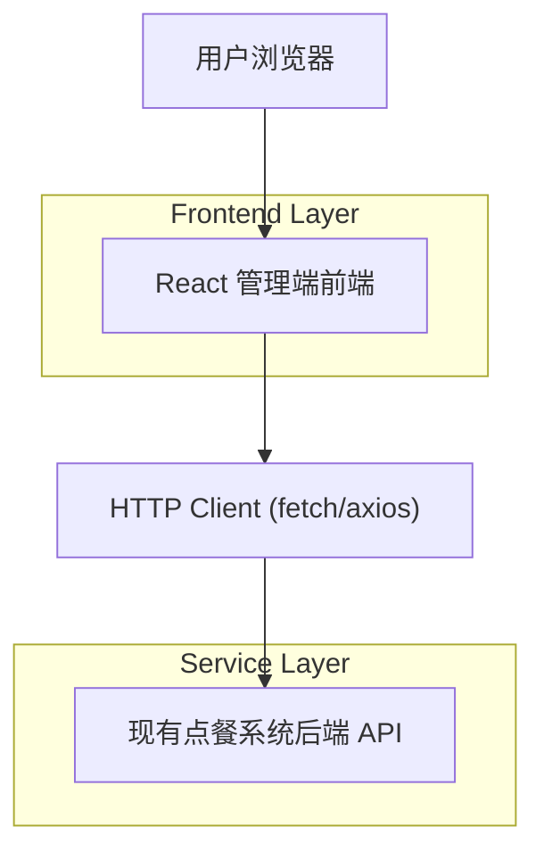

## 1.Architecture design

## 2.Technology Description
- Frontend: React@18 + vite + TypeScript
- UI: tailwindcss@3.4.17 + shadcn-ui（基于 Radix UI）+ lucide-react（图标）
- State/Data: TanStack Query（接口请求缓存与失效）
- Forms: react-hook-form + zod（表单与校验）
- Backend: 复用现有点餐系统后端（本次以 UI 重构为主，不新增服务）

## 3.Route definitions
| Route | Purpose |
|-------|---------|
| /admin/login | 管理端登录与会话初始化 |
| /admin | 控制台总览（指标卡片、快捷入口、全局布局壳） |
| /admin/orders | 订单管理：列表/筛选/详情与状态操作 |
| /admin/menu | 菜品与分类管理：维护与上下架 |
| /admin/tables | 桌台/二维码管理：维护与下载 |
| /admin/settings | 系统设置：门店信息、配置入口、账号与权限入口 |

## 4.API definitions (If it includes backend services)
无（本次不新增后端 API；前端对接既有 API，并逐页完成适配）。

## 5.Server architecture diagram (If it includes backend services)
无。

## 6.Data model(if applicable)
无（不改动数据模型）。

---

### 迁移策略（工程落地）
1. 引入 Tailwind v3.4.17：建立 `tailwind.config` 设计 tokens（颜色、圆角、阴影、字体、间距），并统一全局样式入口。
2. 初始化 shadcn-ui：确定主题（light/dark 可选）、基础组件清单与目录结构；将“按钮/输入/弹窗/表格/Toast/下拉菜单”等作为迁移基座。
3. 建立管理端布局壳：Sidebar + Topbar + Content；将路由与权限门禁（如有）集中处理。
4. 逐页迁移：订单管理 → 菜品管理 → 桌台管理 → 设置；每页完成后删除对应旧样式与重复组件。
5. 质量门槛：统一交互态（hover/focus/disabled/loading）、统一空/错/加载态、统一表单校验与错误展示；对关键操作加入二次确认与乐观/非乐观刷新策略（与后端一致）。

### 组件规范（shadcn-ui 使用约束）
- 只在一个地方定义设计 tokens：优先通过 Tailwind theme 与 CSS variables 驱动，避免页面级随意写颜色值。
- 页面只组合组件不“自造轮子”：新增 UI 形态优先扩展 shadcn 组件（variants/slots），再考虑新组件。
- 表格统一：列表页统一使用 Table + Toolbar（筛选/搜索/操作）+ Pagination 模式。
- 反馈统一：成功/失败用 Toast；危险操作用 AlertDialog；编辑用 Dialog/Sheet（根据信息密度）。
